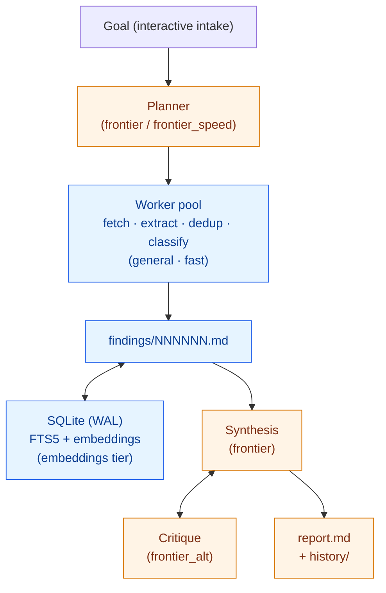

# research-agent

## What is this and why does it exist?

Existing AI research agents are cloud-only, opaque about where their answers
came from, and lock you into one vendor. **alpha-research** is a different
shape: a CLI daemon that runs on your laptop, defaults to local models via
LM Studio (so the wallet cost is `$0`), and treats every claim as something
that has to land in a footnote with a Wayback archive URL behind it.

You hand it a goal — *"Compare Pydantic AI, LangGraph, and CrewAI"*,
*"Profile this contractor for due diligence"*, *"Track Project 2025
implementation across federal agencies"* — and walk away. A planner spawns
worker tasks (fetch, extract, dedup, classify), findings accumulate in a
per-job folder with a SQLite index, a synthesizer rewrites a `report.md`
with inline citations, a critic on a different model pushes back, and the
whole thing runs under a deterministic job ID with `start` / `status` /
`stop` / `resume` lifecycle commands a sysadmin would recognize.

**Who it's for:** investigative journalists, security researchers,
due-diligence work, anyone who needs to kick off a multi-hour run overnight
and wake up to a report with citations they can defend.

**What it's NOT:** a chatbot, a real-time tool, or the right answer to a
one-off question you could resolve with a single web search.

> 🚧 **Status: actively developed.** v1 baseline is shipped and validated
> end-to-end ($0 local-mode runs produce real, sourced reports). The
> [open issues](../../issues) are the roadmap — see
> [#107](../../issues/107) for the connector buildout epic and
> [#158](../../issues/158) for the active connector smoke-fix sweep.
> Expect rough edges; PRs and issue reports welcome.

> **MIT licensed**, contributions welcome — see
> [`CONTRIBUTING.md`](CONTRIBUTING.md) for the issue-driven workflow and
> [`LICENSE`](LICENSE) for terms.

This README is the entry point. It walks an operator from "fresh laptop" to
"24-hour soak running unattended". Deeper detail lives alongside it:

- [`ai-agent-research-setup.md`](ai-agent-research-setup.md) — model
  routing, hardware sizing, LM Studio ergonomics.
- [`ai-agent-investigation-playbook.md`](ai-agent-investigation-playbook.md)
  — investigation patterns and source taxonomy.
- [`research-agent-implementation-guide.md`](research-agent-implementation-guide.md)
  — the locked-in v1 architecture (Pydantic AI, SQLite, per-job folder,
  Typer CLI, model tiers).
- [`AGENTS.md`](AGENTS.md) — repo map, tech stack, and conventions for
  AI coding agents (and humans) working in this codebase.
- [`CLAUDE.md`](CLAUDE.md) — how the
  [alpha-loop](https://github.com/bradtaylorsf/alpha-loop) issue-driven
  build loop drives planning / build / PR flow here.

## Architecture



Blue = local LM Studio tiers (free at the wallet). Orange = OpenRouter
cloud tiers (priced — see [Costs](#costs)). The full tier roster lives in
[`config/models.yaml`](config/models.yaml).

## Direct connector kinds

The planner can dispatch directly to any of the connectors below instead
of falling back to `web_search` with a `site:` operator. Each row here
mirrors what the planner sees in its system prompt — same description,
same optional payload knobs, same example query. The table is generated
from `src/research_agent/tools/_registry.py` via
`scripts/regen_readme_kinds.py`; do not hand-edit between the sentinels.

<!-- BEGIN: direct-connector-kinds (auto-generated) -->

| Kind | What it covers | Optional payload knobs | Example query |
|---|---|---|---|
| `bbb_search` | Better Business Bureau profiles + ratings (Playwright, no auth) | — | `SBI Builders` |
| `calaccess_search` | California Cal-Access campaign finance (Playwright) | `kind: contributions\|independent_expenditures` | `Newsom` |
| `commons_search` | Wikimedia Commons free media files with imageinfo license, author, MIME type, original URL, and thumbnail metadata | `max_results` | `Algerian war photographs` |
| `congress_search` | Bills, members, committees, hearings, congressional record (Congress.gov v3 API) | `kind: bill\|member\|committee\|hearing\|congressional-record` | `Inflation Reduction Act` |
| `courtlistener_search` | Federal & state court opinions, dockets (RECAP), oral arguments — requires `COURTLISTENER_API_TOKEN` | `kind: opinions\|dockets\|oral_arguments` | `Schedule F appellate` |
| `edgar_search` | SEC filings (10-K, 10-Q, 8-K, Form 4) — requires `RESEARCH_USER_AGENT` w/ contact email | `form_type: 10-K\|8-K\|...` | `Cisco cybersecurity` |
| `fec_search` | Candidates, committees, schedule A/E filings (OpenFEC) | `kind: candidates\|committees\|schedules/schedule_a\|schedules/schedule_e` | `Trump 2024 committee` |
| `fedregister_search` | Federal Register rules, proposed rules, agency notices since 1994 (no auth) | `since: YYYY-MM-DD`, `agencies: [...]` | `Schedule F` |
| `gdelt_search` | GDELT — Global news event aggregator, no `site:` operator (no auth) | `since: YYYY-MM-DD`, `language: english` | `Project 2025 mainstream coverage` |
| `iarchive_search` | Internet Archive texts, audio, movies, and web-archive collection metadata through advancedsearch.php | `mediatype: texts\|audio\|movies\|web`, `page: <int>` | `Pullman Strike` |
| `lda_search` | Senate Lobbying Disclosure Act filings (registrants, contributions) | `kind: filings\|registrants\|contributions` | `Heritage Foundation` |
| `licensing_search` | State contractor / licensing-board lookups (Playwright; CA wired, others stubs) | `state: CA\|TX\|FL\|NY` | `SBI Builders` |
| `linkedin_search` | LinkedIn person/company lookup via Proxycurl or Lix — requires broker key | `kind: person\|company` | `Sundar Pichai` |
| `littlesis_search` | Power-mapping database — entities, donations, board seats, family ties (lead, not evidence) | `kind: entities\|relationships` | `Peter Thiel` |
| `loc_search` | Library of Congress digital collections, including Chronicling America through the unified loc.gov API | `collection: chronicling-america\|prints\|manuscripts\|recordings\|maps`, `page: <int>` | `battle of algiers` |
| `nonprofits_search` | ProPublica Nonprofit Explorer (Form 990 filings, no auth) | — | `Heritage Foundation` |
| `opencorporates_search` | Global company registry — requires `OPENCORPORATES_API_KEY` | `jurisdiction: us_ca\|gb\|...` | `Acme Holdings` |
| `openlibrary_search` | Open Library book metadata, ISBN/OCLC/LCCN identifiers, and Internet Archive scan IDs through search.json | `max_results` | `Pullman Strike 1894` |
| `sanctions_search` | OFAC SDN + UK sanctions lists (local index, no auth) | — | `Wagner Group` |
| `scholar_search` | Google Scholar via SerpAPI — requires `SERPAPI_KEY` | `kind: case_law\|articles` | `Section 230 appellate` |
| `sos_search` | State Secretary-of-State business entity filings (Playwright; CA wired, others stubs) | `state: CA\|DE\|NV\|...` | `Acme Corp` |
| `trove_search` | Trove / National Library of Australia metadata for newspapers, books, photos, magazines, oral histories; metadata-only default | `category`, `zone`, `sortby` | `White Australia Policy 1901` |
| `usaspending_search` | Federal contracts, grants, loans (award-level detail, no auth) | `award_type: contracts\|grants\|loans` | `Heritage Foundation contract` |
| `wikidata_search` | Wikidata Query Service raw SPARQL for biographical, relational, occupational, place, and entity-ID data | `max_results` (client-side truncation; SPARQL should include `LIMIT`) | `SELECT ?item ?itemLabel WHERE { ?item wdt:P31 wd:Q5; wdt:P19 wd:Q90 . SERVICE wikibase:label { bd:serviceParam wikibase:language "en". } } LIMIT 3` |
| `wikisource_search` | Wikisource transcribed primary documents across per-language hosts; fetch returns the full source text in cleaned_text | `lang: en|fr|es|de|it|pt|nl|ru|zh|ja|ar`, `max_results` | `Treaty of Versailles` |

<!-- END: direct-connector-kinds -->

## What does the output actually look like?

Every job ends with a `jobs/<job-id>/report.md` — markdown with inline
numeric citations and a source list at the bottom. Trimmed real example:

```markdown
# Investigation Report: Project 2025 Implementation Tracker

## Executive Summary

- **Active Regulatory Shifts:** The EPA and Army Corps of Engineers are
  currently in a public comment period (open through January 5, 2026)
  regarding the revision of "Waters of the United States" (WOTUS)
  definitions following the *Sackett v. EPA* ruling [40, 99].
- **Health Policy Revisions:** Significant proposals within Project 2025
  target HHS and the CDC, including reversing FDA approvals for abortion
  medication (mifepristine), restructuring the CDC into two separate
  agencies, and implementing Medicaid work requirements [38, 43, 44, 116].
- **Expansion of Executive Authority:** The blueprint advocates for
  "unitary executive theory," aiming to place the federal bureaucracy
  under direct presidential control [38, 87].

## Hypotheses

### H1: Identify core policy pillars and specific proposals
**Status:** Confirmed
- **Supporting:** The investigation identified key pillars including
  abortion access restrictions (Comstock Act), immigration overhaul,
  voting rights limitations, and the expansion of executive power [37, 38].

## Open Questions

- **Specific Implementation Dates:** While IRS workforce downsizing is
  noted, the exact timeline for the "quiet cuts" remains unverified [127].

## Recommended Human Follow-Ups

### FOIA candidates
- Correspondence between the EPA and Army Corps of Engineers regarding
  the "wet season" definition in the proposed WOTUS rule [40, 98].

## Sources

1. https://www.aclu.org/project-2025-explained — "Project 2025, Explained"
   (retrieved 2025-05-20)
2. https://www.bbc.com/news/articles/c977njnvq2do — "What is Project 2025?"
   (retrieved 2025-05-20)
40. https://www.alston.com/en/insights/publications/2025/12/epa-army-corps...
    — "EPA, Army Corps of Engineers Proposal on Revised WOTUS Definition"
    (retrieved 2025-05-20)
...
```

Bracketed numbers in the body resolve to the numbered list at the bottom.
Each source row carries the canonical URL, the resolved title, and the
retrieval date. Wayback archive URLs are mirrored alongside in
`jobs/<job-id>/sources/` so a deleted page is still defensible.

## Install

### Prerequisites

- Python 3.12+
- Playwright browsers (installed via `playwright install chromium` below)
- `tesseract` (optional but recommended) — enables the PDF OCR escalation
  layer for scanned FOIA responses and image-PDF court filings. Without
  it, those documents silently return degraded text.
  - macOS: `brew install tesseract`
  - Debian/Ubuntu: `apt install tesseract-ocr`

```bash
# editable install with dev extras
pip install -e ".[dev]"

# one-time browser bootstrap (binaries are not pip-installable)
playwright install chromium

# create your local .env from the template
cp .env.example .env
```

`.env` is the only place runtime secrets and operator overrides live — no
`export` required. Lookup order, highest precedence first:

1. Existing process env vars (CI, one-shot `OPENROUTER_API_KEY=... research ...`).
2. `./.env.local` (gitignored, dev-only overrides).
3. `./.env` (or the nearest ancestor walking up to repo root).

The full list of recognized keys lives in `src/research_agent/config.py`
(`EXPECTED_ENV_KEYS`). `.env.example` and `research doctor` both read from
that list, so there is no drift.

### Required / commonly used

| Key | Required | Purpose |
|---|---|---|
| `OPENROUTER_API_KEY` | yes | Cloud synthesis tier (Claude Opus / Haiku via OpenRouter). |
| `BRAVE_SEARCH_API_KEY` | no | Brave Search API key (free tier ~2000 queries/month). When set, `web_search` engine `auto` picks Brave over the DDG-Playwright scraper. |
| `LMSTUDIO_BASE_URL` | no | Override the default `http://localhost:1234/v1`. |
| `RESEARCH_HEADFUL` | no | Set to `1` to launch Playwright in headed mode for debugging. |
| `YOUTUBE_API_KEY` | no | YouTube Data API v3 key (free quota: 10,000 units/day). When set, `tools/youtube.py:search` uses the official API; absent, it falls back to scraping the public results page via Playwright. |

### Connector-specific and advanced

<details>
<summary>Click to expand — escalation toggles, connector API keys, broker switches</summary>

| Key | Required | Purpose |
|---|---|---|
| `RESEARCH_USER_AGENT` | no | Override default UA sent by httpx + Playwright. |
| `RESEARCH_IGNORE_ROBOTS` | no | Set to `1` to bypass robots.txt checks in `web_fetch`. |
| `RESEARCH_PDF_VLM_ESCALATION` | no | Set to `1` to enable Opus 4.7 vision escalation for PDFs that fail every cheaper layer. Off by default — costs real money; emits a `pdf_vlm_escalation` WARN event when fired. |
| `RESEARCH_OCR_VLM_ESCALATION` | no | Set to `1` to enable Opus 4.7 vision escalation for image OCR when Tesseract and the local VLM both fail. Off by default — costs real money; emits an `ocr_vlm_escalation` WARN event when fired. |
| `RESEARCH_DAEMON_PROGRESS` | no | Set to `0` to suppress the foreground Rich progress bar the daemon writes to stdout when run interactively. |
| `COURTLISTENER_API_TOKEN` | no | CourtListener API token (free w/ signup) — required by `tools/courtlistener.py`. Authenticated tier is 5,000 req/hr; anonymous traffic is throttled to the point of unusability. |
| `DATA_GOV_API_KEY` | no | api.data.gov key (free w/ signup at <https://api.data.gov/signup/>) — used by `tools/fec.py` (OpenFEC). Authenticated tier is 1,000 req/hr; falls back to `DEMO_KEY` (~40 req/hr per IP) when unset. |
| `LDA_API_KEY` | no | Senate Lobbying Disclosure Act API key (free, optional, register at <https://lda.senate.gov/api/register/>) — used by `tools/lda.py`. Anonymous works for low-volume; authenticated raises rate limits. Sent via `Authorization: Token <key>`. |
| `OPENCORPORATES_API_KEY` | no | OpenCorporates API token — used by `tools/opencorporates.py`. **Required for any live request:** anonymous v0.4 access is now gated (returns HTTP 401), so without a key the connector returns no results and smoke skips cleanly. Token rides as `?api_token=<key>`. Public-benefit access by emailing service desk; commercial pricing £2,250–£12,000/yr. |
| `TROVE_API_KEY` | no | Trove/National Library of Australia API key — used by `tools/trove.py`. Keys expire after 12 months and require renewal by email. Sent as `X-API-KEY`, not a URL parameter. Connector defaults to metadata-only; no automatic full-text downloads. |
| `SERPAPI_KEY` | no | SERPAPI key — required by `tools/scholar.py` (Google Scholar engine, case law + academic). Plans start at $75/mo for 5k searches across all engines; per-query ≈ $0.015. Sign up at <https://serpapi.com/>. |
| `LINKEDIN_DATA_API_KEY` | no | LinkedIn data-broker key (default broker: Proxycurl) — required by `tools/linkedin.py`. Per-lookup ≈ $0.01–$0.05; gate fetches behind explicit planner tasks. Sign up at <https://nubela.co/proxycurl/>. |
| `LINKEDIN_BROKER` | no | Broker recipe used by `tools/linkedin.py`. `proxycurl` (default) or `lix`; switching to `lix` consults `LIX_API_KEY` instead of `LINKEDIN_DATA_API_KEY`. |
| `LIX_API_KEY` | no | Lix data-broker key (<https://lix-it.com/>) — only consulted when `LINKEDIN_BROKER=lix`. Similar per-lookup pricing to Proxycurl. |
| `RESEARCH_REDDIT_USER_AGENT` | no | Override the User-Agent `tools/reddit.py` sends. Reddit's anonymous JSON endpoint 403s the project's descriptive UA; the connector defaults to a Chrome UA. Set this when you have a registered OAuth app or want a different override than `RESEARCH_USER_AGENT` (consulted next in the fallback chain). |
| `RESEARCH_MODELS_CONFIG` | no | Path to the models routing YAML the daemon loads. Defaults to `config/models.yaml` relative to cwd. Set when running out-of-tree or pointing at a packaged config. |
| `RESEARCH_DB_PATH` | no | Override the SQLite index path the daemon uses. Unset uses `data/index.sqlite`. Useful for isolating runs under test or pointing at a writable disk. |
| `RESEARCH_JOBS_ROOT` | no | Override the directory that holds per-job folders. Unset uses `jobs/`. Useful for redirecting big runs onto a larger disk. |
| `SANCTIONS_DB_PATH` | no | Override where `tools/sanctions.py` writes its SDN/EU index sqlite. Unset uses the module default under `data/sanctions/`. Useful when refreshing into a staging path before atomic swap. |

</details>

## LM Studio

Local tiers run through [LM Studio](https://lmstudio.ai/) at
`http://localhost:1234/v1`. The exact model identifiers the router maps to
each tier live in [`config/models.yaml`](config/models.yaml); never
hardcode model names elsewhere — pick a tier.

**Models to download** (LM Studio UI → Discover → search by exact ID):

| Tier | Model ID | Purpose |
|---|---|---|
| `fast` | `qwen3-4b-instruct-q4_k_m` | Classification, dedup, language detection. |
| `general` | `qwen3-32b-instruct-q6_k` | Worker default — query rewriting, extraction, summarization. |
| `reasoner` | `deepseek-r1-distill-32b-q6_k` | Hypothesis ranking, contradiction detection. |
| `vision` | `qwen3-vl-8b-instruct` | PDF page screenshots, chart reading. |
| `embeddings` | `qwen3-embedding-4b` | Semantic search across findings + sources. |

After downloading, start the LM Studio local server (Developer tab →
Server → Start). The default port is `1234` and the OpenAI-compatible
endpoint mounts at `/v1`. Override with `LMSTUDIO_BASE_URL` if you've
moved it (e.g. `http://192.168.1.10:1234/v1` for a workstation across the
LAN).

`embeddings` intentionally has no cloud fallback — a stall surfaces as a
hard error rather than silently rerouting to a chat model. Keep
`qwen3-embedding-4b` loaded any time you plan to use `research search` or
the daemon's hybrid retrieval.

## OpenRouter

Cloud tiers go through [OpenRouter](https://openrouter.ai/). Create a key
(Dashboard → Keys → Create Key) and paste it into `.env`:

```bash
OPENROUTER_API_KEY=sk-or-v1-...
```

The key drives three tiers:

| Tier | Model | When it fires |
|---|---|---|
| `frontier` | `anthropic/claude-opus-4-7` | Major synthesis, critique, final report, planner rewrites. |
| `frontier_alt` | `moonshotai/kimi-k2-1t` | Critique pass — diverse second opinion. |
| `frontier_speed` | `anthropic/claude-haiku-4-5` | Fast cloud calls when local isn't enough but Opus is overkill; intake follow-ups; tier fallback. |

`research doctor` sanity-checks the key shape (`sk-or-` prefix) without
hitting the network. List prices live in `config/models.yaml` under
`pricing:` and feed the budget tracker (`src/research_agent/llm/budgets.py`).

## `research doctor`

```bash
research --help
research --version          # print package version
research doctor             # environment readiness checks (Rich table)
research doctor --json      # same report as machine-readable JSON
```

`research doctor` is the canonical wiring check. It verifies:

- Python ≥ 3.12 and the `.env` files that were loaded.
- Every key in `EXPECTED_ENV_KEYS` (presence + masked tail).
- `OPENROUTER_API_KEY` shape (`sk-or-` prefix).
- LM Studio reachability at `LMSTUDIO_BASE_URL` (optional check, never required).
- `data/` and `jobs/` exist and are writable.
- SQLite WAL mode is selectable.
- `config/models.yaml` parses.

Required failures exit non-zero (safe to wire into CI as a pre-flight
gate). Optional skips (LM Studio unreachable, optional env keys missing)
never affect the exit code.

## Walk-through

End-to-end: from clean repo to a finished report.

```bash
# 1. Verify the stack.
research doctor
# All required checks should be green. LM Studio "skip" is fine if you're
# only running cloud tiers; "fail" on OPENROUTER_API_KEY is not.

# 2. Start a job. The daemon runs detached; control returns immediately.
research start --skip-intake \
    --goal "Compare Pydantic AI, LangGraph, and CrewAI" \
    --budget-usd 5.00 \
    --time-cap 24 \
    --disk-cap-gb 10
# → Started job 2026-05-02-compare-pydantic-ai- (daemon pid 12345).
#   Tail logs with: research logs 2026-05-02-compare-pydantic-ai- -f

# 3. See what's running.
research list                          # newest first

# 4. Watch progress live.
JOB=$(research list --json | jq -r '.[0].id')
research status "$JOB" --watch         # Rich panel, refreshes every 2s

# 5. Tail events as they fire.
research logs "$JOB" -f

# 6. Read the report when synthesis lands (auto-rewrites as it iterates).
research view "$JOB" --report          # opens $EDITOR on a TTY

# 7. Stop early if you want — graceful by default.
research stop "$JOB"                   # daemon finishes current task, then synthesizes
research stop "$JOB" --kill            # hard SIGTERM/SIGKILL escalation

# 8. Resume from the last checkpoint after a crash or a clean stop.
research resume "$JOB"
```

For long unattended runs, see [macOS hygiene](#macos-hygiene) below.

## Directory layout

### Per-job folder (`jobs/<job-id>/`)

Every job is a self-contained folder. The cross-job DB only mirrors
metadata for fast queries — the folder is the source of truth.

```
jobs/<job-id>/
├── job.json              # canonical metadata (id, goal, status, timestamps)
├── intake.json           # frozen intake answers
├── goal.md               # human-readable goal + scope
├── plan/                 # planner state (versioned)
├── findings/             # findings/NNNNNN.md (zero-padded, monotonic)
├── sources/              # symlinks/copies of canonical source markdown
├── synthesis/            # synthesis/NNNN.md (versioned)
├── critique/             # critique/NNNN.md (versioned)
├── report.md             # current report (rotated to report.history/ on rewrite)
├── report.history/       # archived prior reports
├── events.jsonl          # append-only event log
├── daemon.pid            # written on spawn, removed on clean exit
├── daemon.out.log        # daemon stdout
├── daemon.err.log        # daemon stderr
└── STOP                  # presence signals graceful stop request
```

Job IDs are deterministic: `YYYY-MM-DD-<slug>` derived from the intake
goal. All on-disk writes go through atomic `*.tmp` + `os.replace` so a
crashed process never leaves half-written sidecars.

### Cross-job state (`data/`)

```
data/
├── index.sqlite          # WAL-mode; jobs, findings, sources, llm_calls, FTS5, embeddings
├── index.sqlite-wal
├── index.sqlite-shm
└── llm_cache.sqlite      # LLM response cache (separate file for safe wipe)
```

`research config cache-clear` wipes `llm_cache.sqlite` (and its `-wal`/
`-shm` sidecars) without touching `index.sqlite`.

### Gitignored regenerable dirs

`jobs/`, `runs/`, `data/`, `logs/`, `sessions/`, `.alpha-loop/`, `.venv/`.
Lockfiles (`uv.lock`) are committed.

## CLI surface

### Job verbs

```bash
research start --skip-intake --goal "<goal>" \
    [--budget-usd 5.0] [--time-cap 24] [--corpus path/to/notes] [--disk-cap-gb 10]

research list                      # newest first; Rich on a TTY, JSON otherwise
research list --json
research list --status running

research status <job-id>           # detailed Rich panel
research status <job-id> --watch   # refresh every 2s

research view <job-id>             # report.md in $EDITOR (or stdout off-TTY)
research view <job-id> --report
research view <job-id> --findings  # latest findings/NNNNNN.md
research view <job-id> --sources

research logs <job-id>             # print existing events.jsonl entries
research logs <job-id> -f          # follow appended events
research logs <job-id> --level ERROR

research stop <job-id>             # graceful: drop STOP flag
research stop <job-id> --kill      # SIGTERM, then SIGKILL after 10s

research resume <job-id>           # respawn daemon, restore from checkpoint
research resume <job-id> --force   # resume even when completed/failed

research search "<query>"          # hybrid FTS5 + semantic (cross-job)
research search "<query>" --fts-only
research search "<query>" --job <job-id>
research search "<query>" --kind findings
research search "<query>" --kind sources
research search "<query>" --json

research export <job-id> --zip
research export <job-id> --md-bundle
research export <job-id> --zip --out PATH
research export <job-id> --md-bundle --include-history

research compare <ref-a> <ref-b>           # delta table (counts, departments, hosts)
research compare <ref-a> <ref-b> --json    # machine-readable deltas
research compare <ref-a> <ref-b> --side-by-side   # unified diff via $PAGER
```

`research start` runs interactive intake (or accepts `--skip-intake --goal
"..."` as a non-interactive testing back door), creates the job folder +
DB row, and spawns a detached daemon via
`subprocess.Popen(start_new_session=True)`. The PID is written atomically
to `jobs/<id>/daemon.pid`; the daemon's stdout/stderr land in
`jobs/<id>/daemon.{out,err}.log`.

`research search` defaults to a hybrid pass: FTS5 on `findings_fts` /
`sources_fts` plus semantic cosine over `embeddings` blobs, deduped and
fused via reciprocal-rank fusion (k=60). Pass `--fts-only` for a
keyword-only escape hatch (useful when LM Studio is offline or for
debugging FTS5 syntax).

`research export` bundles a job for sharing. `--zip` walks
`jobs/<job-id>/` into a `ZIP_DEFLATED` archive; `--md-bundle` concatenates
intake, `report.md`, every finding, and the source list into one navigable
markdown file. Exactly one mode flag is required.

`research compare` diffs two runs by counts (tasks, findings, sources,
plan versions, drain-replans, cornerstone hits), department coverage, and
source-host frequency. Each `<ref>` is either a live job id or a path to
a `report.md` (works on archived copies under `jobs/<id>/archive/` even
after the job's DB rows are gone). Re-running `research start` against the
same goal auto-archives the prior `report.md` into that folder so this
command always has something to compare against; pass `--fresh-reset` to
opt back into the legacy "fail on collision" behavior.

### Config verbs

```bash
research config cache-clear        # wipe data/llm_cache.sqlite
```

The LLM response cache lives in its own SQLite file, keyed on
`(provider, model, prompt, sampling-params, tool-defs)` with a 30-day
default TTL. The router opts in per call (`cache=True`) — deterministic
extractions opt in, exploratory synthesis opts out.

### Hidden smoke verbs

`_smoke-llm` and `_smoke-tool` are operator/CI helpers, hidden from
`--help` but stable enough to script against. See
[Troubleshooting](#troubleshooting) for usage.

## Costs

Local LM Studio inference is free at the wallet (the cost is the GPU/CPU
time on your laptop). All dollar spend goes through OpenRouter via the
`frontier`, `frontier_alt`, and `frontier_speed` tiers.

### Realistic per-run dollar ranges

The default cap on `research start` is `--budget-usd 5.00`. Typical
spend for a single run, depending on goal scope and aggressiveness:

| Run shape | Typical spend | Notes |
|---|---|---|
| Quick recon (≤ 1 hr, ~50 tasks) | $0.10 – $1.00 | Mostly local; one or two cloud syntheses. |
| Half-day investigation (~4 hr) | $1 – $5 | Several synth + critique passes; cap defaults handle this. |
| 24-hour soak (Phase 6 fixture) | $5 – $25 | Set `--budget-usd 25.00` for the full soak per `tests/integration/test_phase6_soak_24h.md`. |

The exact ratio depends on how often the planner triggers cloud calls,
which models actually serve them (Opus is ~25× the price of Haiku per
output token), and whether the LLM cache returns hits.

### What triggers cloud calls

In rough order of frequency:

- **Synthesis passes** — `frontier` for major checkpoints, `frontier_speed`
  as a budget-aware fallback if `frontier` would tip over the cap.
- **Critique** — `frontier_alt` is preferred so the synthesizer and critic
  disagree productively.
- **Adaptive intake follow-ups** — `frontier_speed` for short clarifying
  turns during interactive intake.
- **Local-tier fallbacks** — when an LM Studio tier times out or returns a
  `RateLimitError`, the router routes to the tier's `fallback_tier`. This
  is the only path where a "local-looking" task quietly costs money;
  watch for `tier_fallback` events in `events.jsonl` if your spend looks
  high.

### How the budget cap behaves

The cap is enforced in `src/research_agent/llm/budgets.py` at the
OpenRouter wrapper — every cloud call passes through it; no direct
OpenRouter clients exist elsewhere.

- **Soft warning at 90 %.** A single `WARNING` log fires the first time
  spend crosses 90 % of the cap. Use it as your "wrap up" signal if
  watching live.
- **Hard stop at 100 %.** `BudgetTracker.precheck()` raises
  `BudgetExceeded` before the next cloud call ships. The loop catches it,
  emits `cap_hit`, and triggers a **final-pass synthesis** on the cheaper
  `frontier_speed` tier so the user gets a report. If even
  `frontier_speed` would blow the cap, a template stub is rendered from
  on-disk findings without any LLM call (per issue #39).
- **State survives restarts.** `BudgetTracker` re-hydrates `spent` from
  `jobs.cost_so_far_usd` at construction, so a daemon restart picks up
  the same running total.
- **Local tiers are free.** `cost_usd = 0.0` for local rows in
  `llm_calls`; only OpenRouter tiers are priced. Pricing is read from
  the `pricing:` block in `config/models.yaml` (manually maintained).

## Compared to other research tools

The questions you're going to ask (and that issue reporters will ask):
*"why not LangGraph / CrewAI / Gemini Deep Research / Perplexity?"* Honest
answer is "because they're solving slightly different problems" — laid
out so you can pick the right tool for what you're doing:

| | alpha-research | LangGraph | Gemini Deep Research | Perplexity Pro |
|---|---|---|---|---|
| Runs locally | ✅ | ⚠️ framework — you provide infra | ❌ | ❌ |
| $0 default cost | ✅ | depends | ❌ | ❌ subscription |
| Source attribution + Wayback archival | ✅ | manual | ⚠️ partial | ✅ |
| Multi-hour unattended runs | ✅ | manual | ❌ | ❌ |
| CLI lifecycle (`start` / `stop` / `resume`) | ✅ | ❌ | ❌ | ❌ |
| Per-job folder + cross-job index | ✅ | ❌ | ❌ | ❌ |
| Cost cap enforcement | ✅ | manual | ❌ | n/a |
| Pre-built agentic primitives | ❌ build-your-own | ✅ | ✅ | ✅ |
| Conversational UX | ❌ | ❌ | ✅ | ✅ |

If you want a chat box that answers a single question, use Perplexity. If
you want to wire a graph by hand, use LangGraph. If you want to hand a
CLI a goal and walk away with a defensible report eight hours later,
that's the niche this project is in.

## Roadmap / known limitations

The 🚧 callout above is honest, but vague. Specifics, in priority order:

- **Single-machine only.** v1 ships single-host; no multi-machine /
  distributed coordination is on the roadmap. A "control plane" would be
  a separate project.
- **No web UI.** CLI-first is intentional — operators run this over SSH
  on a workstation overnight. A read-only status dashboard might land
  later but is not committed.
- **macOS / Linux only.** LM Studio runs on macOS (MLX) or Linux/Windows
  (CUDA), but the daemon's lifecycle code (`launchd` plist, `caffeinate`
  guidance, `softwareupdate`) is only documented for macOS. Linux works
  but needs equivalent `systemd-inhibit` wiring; Windows is untested.
- **Cost model drifts.** OpenRouter pricing in `config/models.yaml` is
  manually maintained — provider price changes don't auto-sync. Run
  `research doctor --json` and compare against the OpenRouter dashboard
  if your spend looks off.
- **Connector buildout is in flight.** Issue [#107](../../issues/107) is
  the connector epic; [#158](../../issues/158) is the active smoke-fix
  sweep against the post-#107 bug list (anonymous-tier breakages,
  request-shape regressions, env-var skip behavior). Expect intermittent
  smoke skips on niche connectors until that closes.
- **Synthesizer can close subgoals too aggressively.** Tracked at
  [#159](../../issues/159) — broad-scope subgoals sometimes terminate
  overnight runs early. Workaround: phrase the goal narrowly, or run with
  a longer `--time-cap`.
- **`completion_reason` mislabel.** Tracked at
  [#160](../../issues/160) — clean subgoal closes are labeled
  `user_stopped` rather than `goal_complete`. Cosmetic but misleading
  in `research status` output.

Bug reports are how this list shrinks — open an issue if you hit
something not on it.

## macOS hygiene

A 24-hour soak on a laptop has three failure modes that aren't bugs in
the daemon: idle sleep, OS auto-reboot, and you closing the lid in the
wrong way. Address them once, up front.

### Prevent idle sleep — `caffeinate -i -w <pid>`

After `research start` returns, capture the daemon PID and tie a
`caffeinate` to it from a second terminal:

```bash
DAEMON_PID=$(cat jobs/<job-id>/daemon.pid)
caffeinate -i -w "$DAEMON_PID" &
```

- `-i` blocks **idle sleep** specifically (the display can still dim,
  which is fine — the soak doesn't need pixels).
- `-w <pid>` ties caffeinate's lifetime to the daemon. When the daemon
  exits — graceful stop, kill, or crash — caffeinate auto-exits with it,
  so there's no orphan process holding the system awake.

Long activity gaps in `events.jsonl` are usually idle-sleep, not a bug
in the daemon. On non-macOS hosts, use the equivalent for your OS (e.g.
Linux `systemd-inhibit --what=idle`).

### Disable auto-reboot for system updates

macOS will silently install and reboot for security updates by default.
A reboot mid-soak loses the daemon and leaves a stale PID file behind.
Either:

- **GUI:** System Settings → General → Software Update → Automatic
  Updates → toggle off "Install macOS updates" and "Install Security
  Responses and system files".
- **CLI:**
  ```bash
  sudo softwareupdate --schedule off
  ```

Re-enable after the soak finishes if you want the OS to keep itself
patched.

### Optional `launchd` plist for auto-resume on boot

If a reboot does happen (power loss, manual restart), you can have the
most recent running job auto-resume. Drop a launch agent at
`~/Library/LaunchAgents/com.alpha.research.resume.plist`:

```xml
<?xml version="1.0" encoding="UTF-8"?>
<!DOCTYPE plist PUBLIC "-//Apple//DTD PLIST 1.0//EN" "http://www.apple.com/DTDs/PropertyList-1.0.dtd">
<plist version="1.0">
<dict>
  <key>Label</key>
  <string>com.alpha.research.resume</string>
  <key>ProgramArguments</key>
  <array>
    <string>/bin/bash</string>
    <string>-lc</string>
    <string>cd /path/to/alpha-research &amp;&amp; \
            JOB=$(./.venv/bin/research list --json --status running 2>/dev/null \
                  | /usr/bin/python3 -c 'import json,sys; jobs=json.load(sys.stdin); print(jobs[0]["id"]) if jobs else None') &amp;&amp; \
            [ -n "$JOB" ] &amp;&amp; ./.venv/bin/research resume "$JOB"</string>
  </array>
  <key>RunAtLoad</key>
  <true/>
  <key>StandardOutPath</key>
  <string>/tmp/research-resume.out.log</string>
  <key>StandardErrorPath</key>
  <string>/tmp/research-resume.err.log</string>
</dict>
</plist>
```

Load it once: `launchctl load ~/Library/LaunchAgents/com.alpha.research.resume.plist`.
Edit `/path/to/alpha-research` to your checkout. Inspect
`/tmp/research-resume.{out,err}.log` if a boot doesn't pick up the job
you expected.

## Troubleshooting

### `research doctor` failures

| Failure | What to do |
|---|---|
| `python: fail` | Install Python 3.12+ (`brew install python@3.12`) and rebuild the venv. |
| `env:OPENROUTER_API_KEY: missing (required)` | Add the key to `.env`. Restart any open shell so the new value is picked up. |
| `openrouter_key_shape: fail` | Key doesn't start with `sk-or-` — copy it again from the OpenRouter dashboard. |
| `lm_studio: skip ... not reachable` | Optional, but local tiers won't work. Start LM Studio, click Server → Start, confirm port `1234`. |
| `writable_dirs: fail` | `data/` or `jobs/` permissions issue. `mkdir -p data jobs && chmod u+rwx data jobs`. |
| `sqlite_wal: fail` | Stdlib SQLite is too old or the temp dir is read-only. Re-run on a writable partition. |
| `models_yaml: fail` | `config/models.yaml` was edited and no longer parses. `git diff config/models.yaml` to inspect. |

When in doubt: `research doctor --json | jq .` for a structured view that
omits the Rich formatting.

### Smoke commands

Two hidden verbs verify the LLM stack and tool registry without spinning
up a job:

```bash
# Single structured-output call against one tier in config/models.yaml.
research _smoke-llm fast "Say hello"
research _smoke-llm general "Say hello"
research _smoke-llm reasoner "Say hello"
research _smoke-llm frontier "Say hello"
research _smoke-llm frontier_alt "Say hello"
research _smoke-llm frontier_speed "Say hello"

# Skipped (exit 0) without --image; reports `output: skipped: vision: no image provided`.
research _smoke-llm vision "Describe this" --image path/to/page.png

# Bypasses Pydantic AI; hits /embeddings directly. Reports `output: dim=<N>`.
research _smoke-llm embeddings "vector me"

# Tool registry probes (Phase 3 connectors).
research _smoke-tool web_search "alpha research project"
research _smoke-tool web_fetch "https://example.com/article"
research _smoke-tool arxiv "transformer interpretability"
research _smoke-tool news "federal reserve"
research _smoke-tool trove_search "White Australia Policy"
research _smoke-tool commons_search "Algerian war photographs"
```

`web_fetch` prints the resolved title, the path that served the fetch
(`httpx` vs `playwright`), HTTP status, word count, the Wayback archive
URL (when Save Page Now completed in time), and the first 200 characters
of cleaned text. A missing `archive_url` is not a fetch failure —
Wayback archival is fire-and-forget.

### Where to read events

- `research logs <job-id> -f` — formatted tail of `events.jsonl` (level
  filter via `--level ERROR`).
- `jobs/<job-id>/events.jsonl` — raw append-only JSON, one event per
  line. `jq` is your friend (`jq 'select(.level=="ERROR")' events.jsonl`).
- `jobs/<job-id>/daemon.err.log` — daemon stderr (uncaught exceptions,
  process-level errors that didn't make it to `events.jsonl`).
- `data/index.sqlite` — cross-job mirror of events / findings / sources /
  llm_calls. Open with `sqlite3 data/index.sqlite` for ad-hoc queries.

### Disk cap

Each job has a per-job disk cap (default `10` GB, override with
`--disk-cap-gb`). The daemon polls `jobs/<id>/` every 5 minutes; when
total usage exceeds the cap, it scores every linked source by
`5 * findings_usage + 1 * fts_title_hits − 0.1 * age_days` and prunes
the lowest-scored 10 % until usage drops below 90 % of the cap. A single
`WARN`/`warning` event marks the cap crossing; one `INFO`/`source_pruned`
event fires per file removed. Pruned ≠ banned: the `sources` row stays
in the cross-job index with `md_path = NULL`, and a future fetch with
the same sha256 transparently re-creates the file under the current job.

## End-to-end testing

The Phase 4 "done when" gate is exercised manually — too heavy and too
cost-bearing for CI. See `tests/integration/test_phase4_e2e.md` for the
playbook (canonical fixture goal, driver script, AC verification
commands, and a triage table for common failures).

The Phase 5 (4-hour daemon-lifecycle soak) and Phase 6 (24-hour
real-goal soak) gates have their own playbooks alongside it:
`tests/integration/test_phase5_lifecycle.md` and
`tests/integration/test_phase6_soak_24h.md`. Phase 6 also captures its
results in `tests/integration/soak_24h_postmortem.template.md` (copy
the `.template.md` to a dated file for your specific run rather than
overwriting the template).
